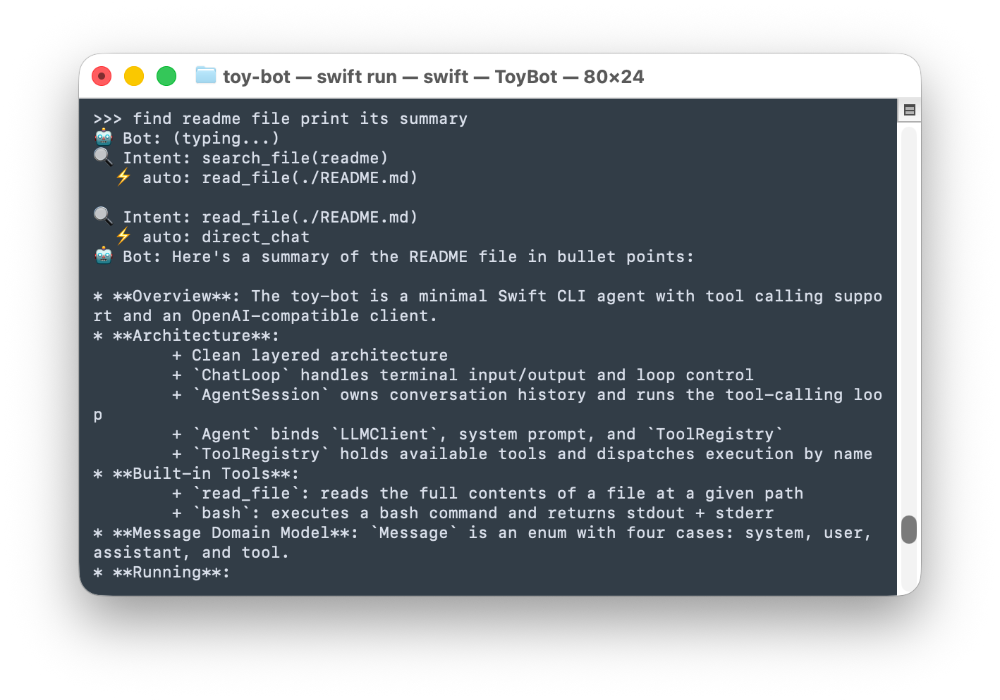

# toy-bot



Minimal Swift CLI agent with tool calling support and an OpenAI-compatible client. This project is built for educational purposes for experimenting with small-model agent patterns. It is heavily inspired by [build-your-own-openclaw](https://github.com/czl9707/build-your-own-openclaw).

## Routing modes

The app can run the assistant in two ways. You choose how the model interacts with tools — this matters a lot for **small local models** (e.g. Llama 3.2 3B), which handle OpenAI-style function calling poorly.

| Mode | CLI / env value | When to use |
|------|-----------------|-------------|
| **Intent Router** | `intent` | Default for **Ollama**. The model never receives tool schemas; it only emits structured JSON intents. Your Swift code executes tools. Synthesis is a separate LLM call. |
| **Tool calling** | `tool-calling` | Default for **OpenAI**. Classic chat completions with `tools` in the request; the model returns `tool_calls` like the OpenAI API. |

**Defaults (if you do not set routing):**

| Provider | Default routing |
|----------|-----------------|
| `ollama` | `intent` |
| `openai` | `tool-calling` |

**Override defaults:**

```bash
# Force OpenAI-style tool calling against Ollama (e.g. large model)
swift run ToyBot --provider ollama --routing tool-calling

# Force Intent Router against OpenAI (e.g. experiment with small models)
swift run ToyBot --provider openai --routing intent
```

Environment variable: `TOYBOT_ROUTING=intent` or `TOYBOT_ROUTING=tool-calling`.

On startup the app prints the active routing mode, for example:

```text
routing: intent
```

---

## Intent Router pattern (routing: `intent`)

This pattern splits work into **three roles** so small models only do one simple job at a time:

1. **Router (LLM)** — Classifies the user message and conversation context into a single **intent** (`read_file`, `bash`, `search_file`, or `direct_chat`). The model does **not** see tool definitions. It is steered with **structured outputs**: `response_format` with a JSON Schema matching `IntentResponseDTO` (OpenAI-compatible / supported by Ollama structured outputs). Router prompts are in **English** for better compatibility with local models.

2. **Executor (Swift)** — Maps `Intent` to real work: `ToolRegistry` runs `read_file` / `bash`, or `search_file` uses a fixed `find` command built in code. The model does not run arbitrary shell; the app decides how to search.

3. **Synthesizer (LLM)** — After tools have run, a **second** call asks the model to answer or summarize using only the **collected context**. For long file content, synthesis uses a **short** message list (focused system prompt + user request + tool context) instead of the full chat history, so small models are less likely to return empty replies. Truncation and retries apply; if the model still returns nothing, a **deterministic excerpt** of the gathered context is shown.

### Deterministic step resolution

Between router calls, **`DeterministicIntentResolver`** can choose the next intent **without** calling the LLM when the next step is obvious from the last tool result, for example:

- After `search_file` returns exactly one path → `read_file` with that path.
- After several paths → pick a shallow path (fewer `/` segments) → `read_file`.
- After a successful `read_file` → `direct_chat` (hand off to synthesis).
- After `bash` returns a single path-like line → `read_file`.

That reduces drift and duplicate “find again” loops on small models.

---

## Tool calling mode (routing: `tool-calling`)

Uses **`InMemoryAgentSession`** with **`ChatAgent`**: the full conversation and OpenAI-style **function** tool schemas are sent on every turn. The model returns `tool_calls`; the app executes tools and calls the LLM again until there are no tool calls. This matches what large models (GPT-4, Claude, strong Ollama models) expect.

---

## Current architecture

Layered layout:

- **`ChatLoop`** (`Presentation`): terminal I/O, `exit` / `quit` / `q`.
- **`AgentSession`** (`Domain/Interfaces`): `chat(_:)` → final `Message`.
  - **`InMemoryAgentSession`**: tool-calling loop (history + LLM + tools until plain assistant reply).
  - **`IntentRoutedSession`**: router → executor loop → synthesizer; optional deterministic resolution between steps.
- **`Agent`** / **`ChatAgent`**: `LLMClient`, system prompt, `ToolRegistry` (used only by tool-calling path).
- **`IntentRouter`** / **`LLMIntentRouter`**: classify → `Intent`.
- **`ActionExecutor`** / **`LocalActionExecutor`**: `Intent` → tool strings.
- **`Synthesizer`** / **`LLMSynthesizer`**: final natural-language answer from collected context.
- **`DeterministicIntentResolver`**: code-only next-step intents when unambiguous.
- **`ToolRegistry`** (`Application/Tools`): dispatches tools by name.
- **`Tool`** (`Domain/Interfaces`): name, description, `parametersSchema`, `execute`.
- **`OpenAIClient`** (`Data`): chat completions; optional `LLMStructuredOutput` for intent JSON schema.
- **`IntentResponseDTO`** (`Data`): JSON shape for router + schema for structured outputs.

## Skills

`toy-bot` supports file-based micro-skills in the `skills/` directory. Each skill is a `.md` file with:

- YAML front-matter (`id`, `name`, `description`, `output_format`)
- system prompt body
- optional `---examples---` section with `user:` / `assistant:` few-shot pairs

At runtime, skills are applied differently by routing mode:

- **`intent` mode (small-model path):**
  - `LLMIntentRouter` receives only skill metadata (id + description)
  - `SkillExecutor` lazily loads only the selected skill file
  - the skill runs in an isolated worker session (system prompt + examples + current request)
- **`tool-calling` mode (large-model path):**
  - skills are injected into the system prompt as a single consolidated block
  - injection is bounded (global character cap + per-skill prompt/example truncation)
  - this avoids extra routing hops and keeps behavior simple for stronger models

This gives small models stricter context isolation, while keeping the large-model path straightforward.

### Included skills

- `conventional-commit`
- `pr-description`
- `todo-breakdown`
- `regex`

### Built-in tools

| Tool | Description |
|---|---|
| `read_file` | Read the full contents of a file at a given path |
| `bash` | Execute a bash command and return stdout + stderr |

### Message domain model

`Message` is an enum — each case carries exactly the data it needs:

```swift
enum Message {
    case system(content: String)
    case user(content: String)
    case assistant(content: String, toolCalls: [ToolCall])
    case tool(content: String, toolCallId: String)
}
```

## Running

```bash
swift run
```

When started, the app prints active `baseURL`, `model`, and **`routing`**, then enters interactive chat:

- prompt: `>>> `
- assistant output: `🤖 Bot: ...`
- **Tool calling mode:** `🔨 Tool: <name>` (tool arguments printed)
- **Intent Router mode:** `🔍 Intent: <label>`; `⚡ auto: <label>` when the next step was chosen by `DeterministicIntentResolver` without the LLM
- exit: `exit`, `quit`, `q`

## Ollama Configuration

`toy-bot` defaults to Ollama with a local model. For **tool-calling** mode with Ollama, prefer models that support function calling well (e.g. `llama3.2`, `qwen2.5`). For **Intent Router** mode, smaller models are more usable because they are not asked to emit OpenAI `tool_calls`.

### Ollama Installation

Official download page: [ollama.com/download](https://ollama.com/download)

```bash
# macOS (Homebrew)
brew install ollama

# Linux
curl -fsSL https://ollama.com/install.sh | sh
```

Start Ollama and pull a model:

```bash
ollama serve
ollama pull llama3.2
```

### Defaults

If you do not pass any config, the app uses:

- provider: `ollama`
- base URL: `http://localhost:11434`
- model: `llama3.2`
- token: not required
- routing: **`intent`** (Intent Router)

## Configure via Environment Variables

| Variable | Description |
|---|---|
| `TOYBOT_PROVIDER` | `ollama` or `openai` |
| `TOYBOT_BASE_URL` | Override base URL |
| `TOYBOT_MODEL` | Model name |
| `TOYBOT_API_TOKEN` | API token (optional for Ollama) |
| `OLLAMA_HOST` | Fallback base URL for Ollama |
| `TOYBOT_ROUTING` | `intent` (Intent Router) or `tool-calling` (OpenAI-style tools) |

```bash
export TOYBOT_PROVIDER=ollama
export TOYBOT_MODEL=llama3.2
export TOYBOT_ROUTING=intent
swift run
```

## Configure via CLI Arguments

```bash
swift run ToyBot --provider ollama --base-url http://localhost:11434 --model llama3.2 --routing intent
swift run ToyBot --provider openai --token sk-... --model gpt-4o-mini --routing tool-calling
```

Supported flags: `--provider`, `--base-url`, `--model`, `--token`, `--ollama-host`, **`--routing`**

## Configuration Priority

1. CLI arguments
2. Environment variables
3. Built-in defaults

## Notes for Ollama

- Token is not required for local Ollama; `Authorization` header is omitted when no token is set.
- Request timeout is set to 5 minutes to accommodate slow local inference.
- If you run Ollama remotely and need auth, pass `--token` or `TOYBOT_API_TOKEN`.
- Structured outputs for the intent router require a recent Ollama that supports `response_format` / JSON schema on `/v1/chat/completions`.

## Contributing skills

Skill contributions are welcome. Please keep skills focused and small-model friendly.

### Skill authoring rules

- One skill = one concrete job (avoid broad "developer assistant" prompts)
- Keep prompts short and specific
- Add 1-3 high-quality few-shot examples
- Define a strict output shape in the prompt (format first, style second)
- Prefer tasks with constrained input/output over open-ended reasoning

### Skill file template

```md
---
id: your-skill-id
name: Human Friendly Name
description: One-line router-facing description
output_format: free_text
---

System prompt text here.

---examples---

user: Example input
assistant: Example output
```

### Submission checklist

- Place the file under `skills/` and use lowercase kebab-case filename
- Ensure `id` matches the filename (without `.md`)
- Validate that examples are realistic and deterministic
- Run `swift build` before opening a PR
